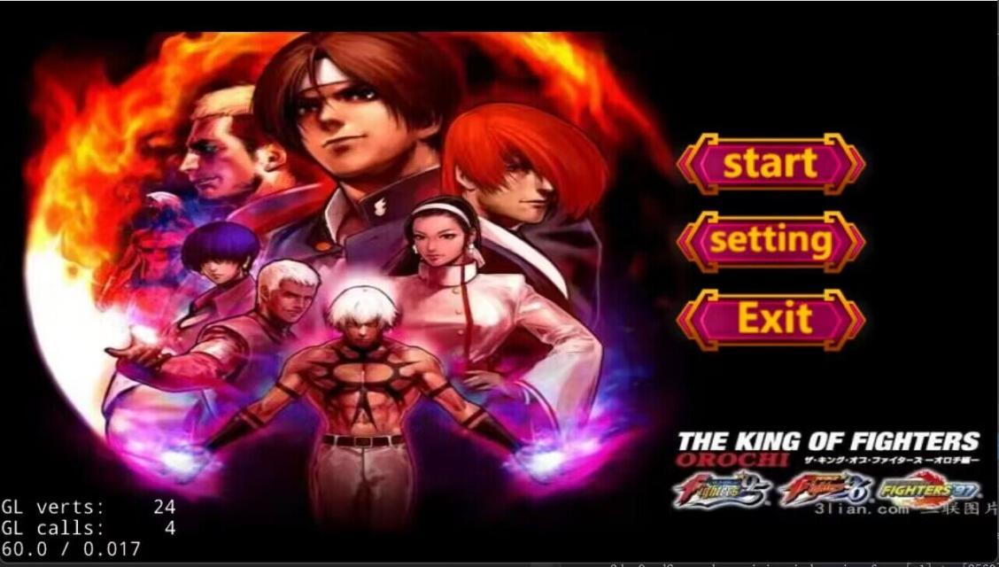
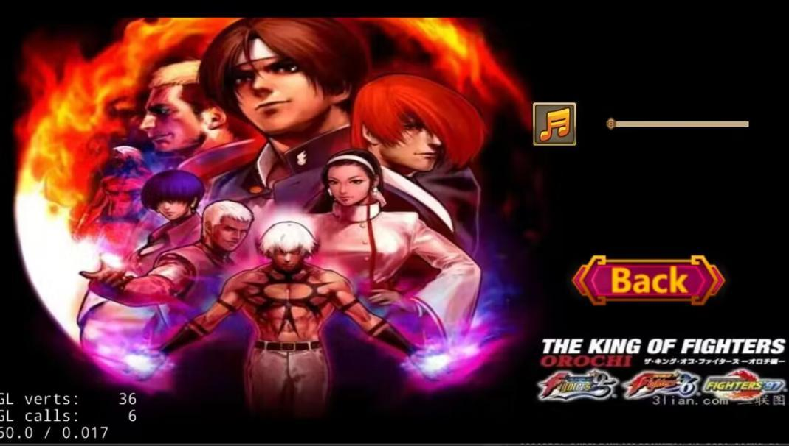
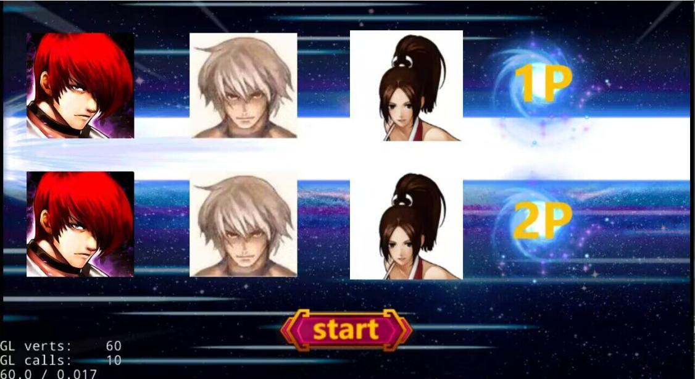
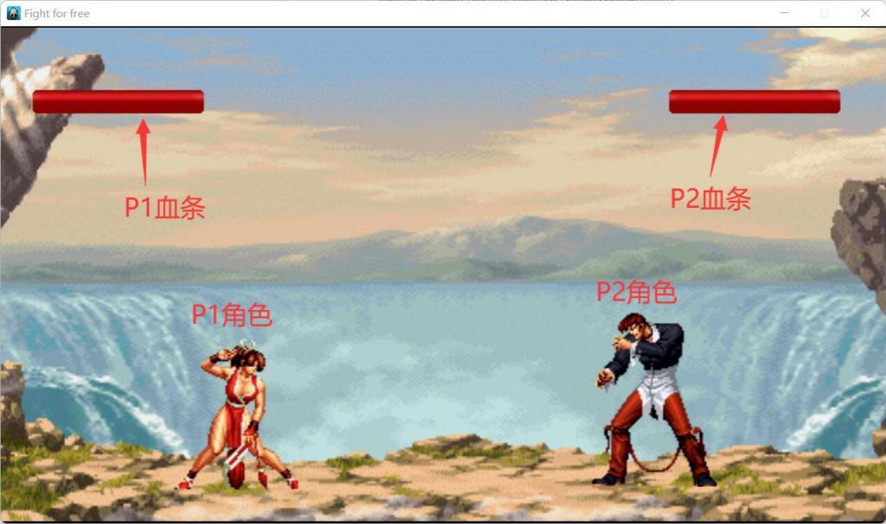
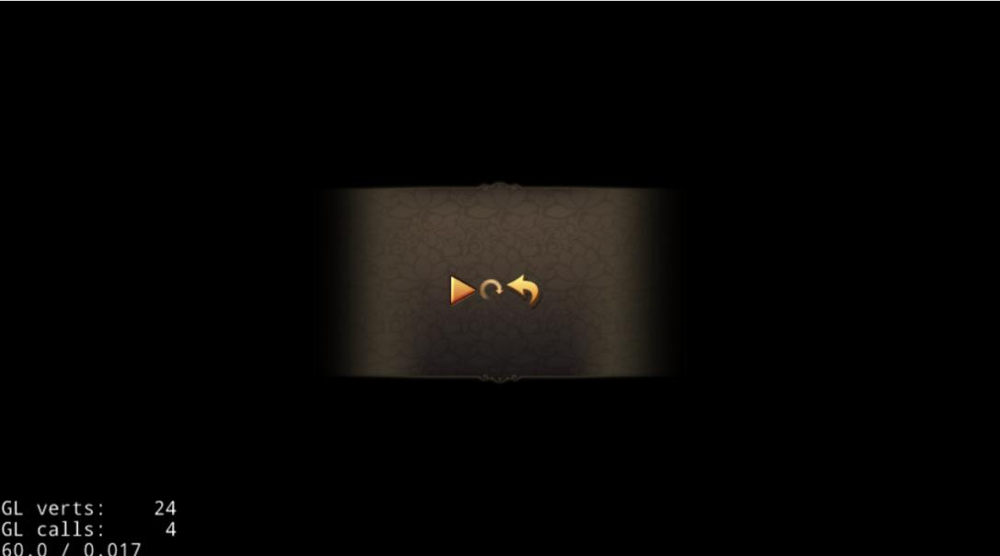
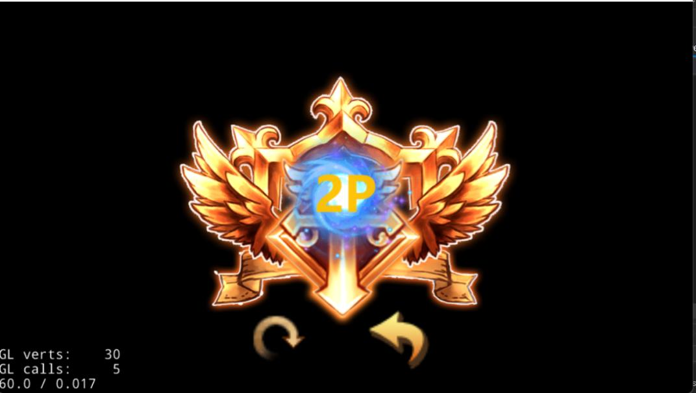

# Project: King of Fighters Style Game (C++/Cocos2d-x)

This project is a two-player, "King of Fighters" style fighting game created for the "Advanced Programming Design Comprehensive Experiment" course. It is built using **C++** and the **Cocos2d-x** game engine, with a strong focus on object-oriented (OOP) design principles.

The game allows two players to select from different characters and engage in a 1v1 fight. The project was co-developed by Liu Jinxiu (刘瑾修) and Gao Jianyu (高建宇).

## Features

- **Main Menu:** A start screen with options to Start, go to Settings, or Exit.
  
- **Settings Menu:** Includes a toggle for background music.
  
- **Character Selection:** A two-player selection screen where each player can choose a unique character.
  
- **2-Player Combat:** Local multiplayer combat scene with health bars for each player, Frame-based animation for attacks with collision detection to reduce opponent's health.
  
- **Pause & Game Over:** A pause scene with resume/quit options and a "Game Over" screen that declares the winner (1P or 2P).
  
  
